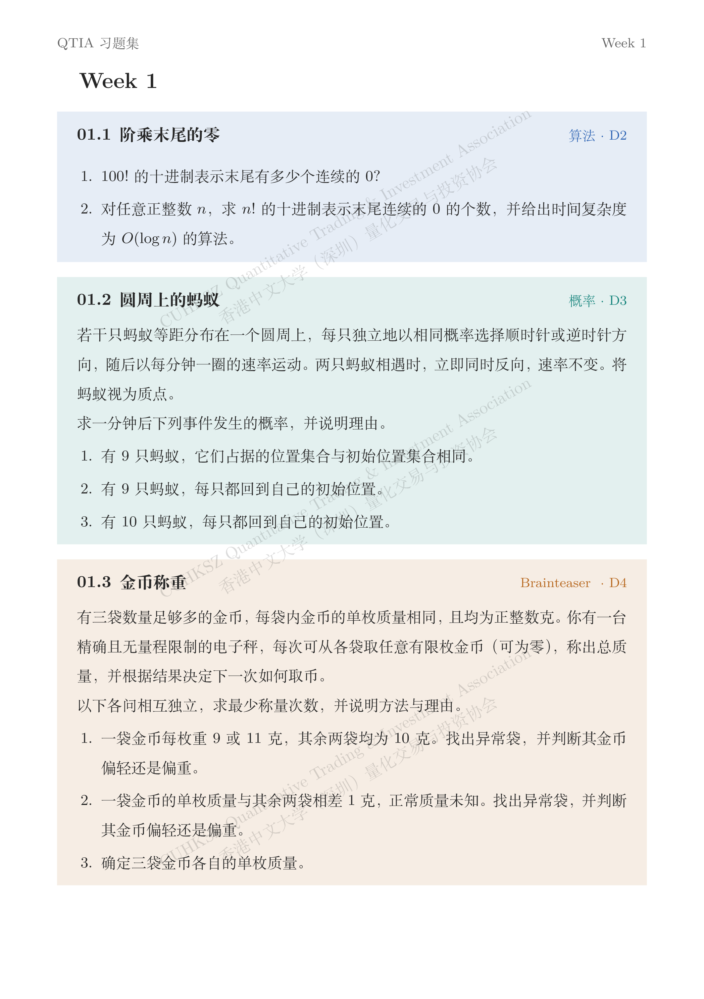

  

  <a href="Week%201.md"><b>Read Week 01 ↗</b></a>
  &nbsp;&nbsp; / &nbsp;&nbsp;
  <a href="https://mp.weixin.qq.com/s/dyWoUoFFrEh4KkIvRbHslw">Original problems</a>
  &nbsp;&nbsp; / &nbsp;&nbsp;
  <a href="https://github.com/jsyzlbw/CUHKSZ-QTIA-Questions-Answer/issues">Discuss an idea</a>

01 WEEK &nbsp; · &nbsp; 03 TOPICS &nbsp; · &nbsp; 08 QUESTIONS

 

Personal solutions to the QTIA weekly problem sets. Each note develops the key observation into a proof, then explores how far the idea extends.

## Week 01

| No. | Problem | The central idea |
| :--- | :--- | :--- |
| `01` | [Trailing zeros in a factorial](Week%201.md#trailing-zeros-in-a-factorial) | Count factors, not digits. |
| `02` | [Ants on a circle](Week%201.md#ants-on-a-circle) | Ignore identities, then recover the order. |
| `03` | [Weighing gold coins](Week%201.md#weighing-gold-coins) | Encode information in a single measurement. |

<b>Beyond the answer</b> &nbsp;—&nbsp; what is inside

- **Algorithms.** A short Python implementation counts trailing zeros in logarithmic time.
- **Probability.** Collision equivalence and preserved cyclic order explain when the ants return.
- **Encoding.** Remainders, binary patterns, and place values turn scale readings into information. All three coin problems extend to **n bags**, with boundary cases and proofs of optimality.

<b>Try the problems first</b> &nbsp;—&nbsp; open the original sheet

 

---

Problems: [QTIA · WeChat source](https://mp.weixin.qq.com/s/dyWoUoFFrEh4KkIvRbHslw). Solutions and extensions are personal notes. Corrections and alternative proofs are welcome via [Issues](https://github.com/jsyzlbw/CUHKSZ-QTIA-Questions-Answer/issues).
